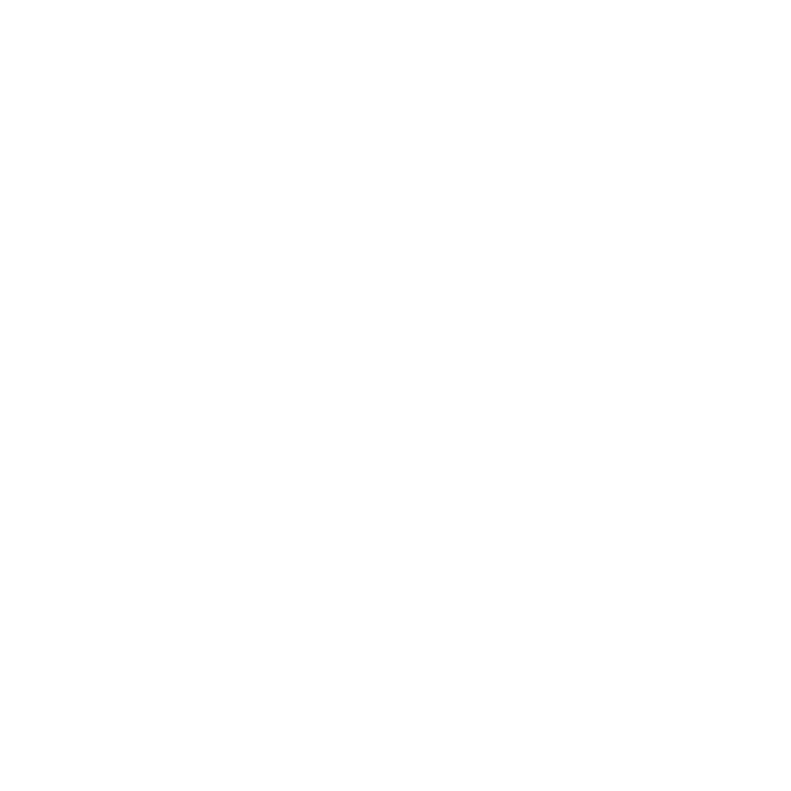

<!-- Improved compatibility of back to top link: See: https://github.com/othneildrew/Best-README-Template/pull/73 -->

<a id="readme-top"></a>

<!-- PROJECT SHIELDS -->
<!--
*** I'm using markdown "reference style" links for readability.
*** Reference links are enclosed in brackets [ ] instead of parentheses ( ).
*** See the bottom of this document for the declaration of the reference variables
*** for contributors-url, forks-url, etc. This is an optional, concise syntax you may use.
*** https://www.markdownguide.org/basic-syntax/#reference-style-links
-->
<div align="center">
  <a href="https://github.com/bibixx/workout-feed/graphs/contributors">
    
  </a>
  <a href="https://github.com/bibixx/workout-feed/network/members">
    
  </a>
  <a href="https://github.com/bibixx/workout-feed/stargazers">
    
  </a>
  <a href="https://github.com/bibixx/workout-feed/issues">
    
  </a>
  <a href="https://github.com/bibixx/workout-feed/blob/main/LICENSE.md">
    
  </a>
</div>

<!-- PROJECT LOGO -->
<br />
<div align="center">
  <a href="https://github.com/bibixx/workout-feed">
    
  </a>

<h3 align="center">Workout Feed</h3>

  <p align="center">
    An iOS app that keeps the Apple Watch's native Workout app stocked with your upcoming planned workouts — from any <code>.workout</code> feed URL you point it at.
    <br />
    <br />
    <a href="https://github.com/bibixx/workout-feed/issues/new?labels=bug">Report Bug</a>
    &middot;
    <a href="https://github.com/bibixx/workout-feed/issues/new?labels=enhancement">Request Feature</a>
  </p>
</div>


<!-- TABLE OF CONTENTS -->
<details>
  <summary>Table of Contents</summary>
  <ol>
    <li>
      <a href="#about-the-project">About The Project</a>
      <ul>
        <li><a href="#built-with">Built With</a></li>
      </ul>
    </li>
    <li>
      <a href="#getting-started">Getting Started</a>
      <ul>
        <li><a href="#prerequisites">Prerequisites</a></li>
        <li><a href="#installation">Installation</a></li>
        <li><a href="#running-in-the-simulator">Running in the Simulator</a></li>
      </ul>
    </li>
    <li>
      <a href="#usage">Usage</a>
      <ul>
        <li><a href="#feed-contract-version-1">Feed contract (version 1)</a></li>
        <li><a href="#producing-a-feed">Producing a feed</a></li>
        <li><a href="#debug-screen">Debug screen</a></li>
      </ul>
    </li>
    <li><a href="#roadmap">Roadmap</a></li>
    <li><a href="#contributing">Contributing</a></li>
    <li><a href="#license">License</a></li>
    <li><a href="#contact">Contact</a></li>
    <li><a href="#acknowledgments">Acknowledgments</a></li>
  </ol>
</details>


<!-- ABOUT THE PROJECT -->
## About The Project

Point Workout Feed at a feed URL — a small JSON manifest plus workout files, hostable on S3, GitHub Pages, nginx, a Worker, anything static — and your planned workouts appear in the watch's **native Workout app** automatically. No watchOS code, works on a free Apple account.

- **Home = the watch schedule.** The list shows what is actually scheduled (grouped by day, with completion state) — read back from WorkoutKit, not from the feed.
- **Set-and-forget.** Full-screen setup only when unconfigured; afterwards settings hide behind ⚙︎ (change feed, sync now, disconnect — which also clears everything the app scheduled).
- **Diff-based sync, resolved per row.** The manifest renders immediately (rows show loading spinners); workout files download concurrently and each row flips to "on watch" as it lands. Unchanged entries are left alone (preserving completion state), content changes are replaced, and entries removed from the feed are pruned — but pruning only runs on a clean pass: if any file failed to fetch, nothing is deleted (a flaky network can't wipe the watch). An empty feed clears the schedule.
- **Stays fresh.** Syncs on launch (30-min throttle), pull-to-refresh, and a background-refresh top-up. Every sync applies the whole window, so the watch stays stocked even when iOS skips background fires.

<p align="right">(<a href="#readme-top">back to top</a>)</p>


### Built With

<div align="center">
  <a href="https://developer.apple.com/xcode/swiftui/">
    
  </a>
  <a href="https://developer.apple.com/documentation/workoutkit">
    
  </a>
  <a href="https://github.com/yonaskolb/XcodeGen">
    
  </a>
</div>

<p align="right">(<a href="#readme-top">back to top</a>)</p>


<!-- GETTING STARTED -->
## Getting Started

There is no App Store release — you build and install the app onto your own iPhone from source.

### Prerequisites

* Xcode 26+ (the app icon is an Icon Composer bundle, compiled by `actool`)
* [XcodeGen](https://github.com/yonaskolb/XcodeGen)
  ```sh
  brew install xcodegen
  ```
* An iPhone (iOS 17+) paired with an Apple Watch — to see workouts arrive on a real watch. For development the iOS Simulator is enough, scheduling included (see [Running in the Simulator](#running-in-the-simulator)). A free Apple developer account suffices for device installs.

### Installation

1. Clone the repo and generate the Xcode project (it's gitignored — XcodeGen generates it from `project.yml`):
   ```sh
   git clone https://github.com/bibixx/workout-feed.git
   cd workout-feed
   xcodegen generate
   ```
   Re-run `xcodegen generate` after adding/removing files or editing `project.yml`.
2. Open `WorkoutFeed.xcodeproj` in Xcode, pick a destination (any iPhone Simulator, or your phone), and hit **⌘R**. For device runs, first set `DEVELOPMENT_TEAM` in `project.yml` to your own team id — signing (team + automatic style) is baked into `project.yml`, so regenerating the project never wipes it.

Prefer the terminal? `deploy.sh` builds, signs, and installs without the Xcode GUI (it also runs `xcodegen generate` for you when the project is missing):

```sh
./deploy.sh        # install to your connected (or Wi-Fi-paired) iPhone
./deploy.sh --sim  # build for the Simulator, boot one, install + launch
```

> [!NOTE]
> Free-account signing expires every 7 days — re-run `./deploy.sh` (or use AltStore/SideStore auto-refresh).

### Running in the Simulator

The whole app works in the iOS Simulator — including scheduling. WorkoutKit's permission prompt appears on first sync, and once granted, workouts land in the simulator's scheduler: rows reach the "on watch" state and the schedule survives relaunches (verified on the iOS 26 runtime). Onboarding, settings, and the [debug screen](#debug-screen) are fully usable too. What you *can't* see is the watch side of the story — whether a workout actually shows up in a watch's Workout app needs real hardware.

**Don't bother pairing a watch simulator.** You *can* pair one (`xcrun simctl pair <watch-udid> <phone-udid>`, with a watchOS runtime installed via Xcode → Settings → Components) — but the watchOS simulator's Workout app is disabled: it launches straight to *"This feature is not available."* There is nothing to see on the simulated watch. A real iPhone + Apple Watch is the only way to verify the watch end of scheduling.

<p align="right">(<a href="#readme-top">back to top</a>)</p>


<!-- USAGE EXAMPLES -->
## Usage

On first launch the app asks for a **feed URL** (and an optional **Authorization** value). Paste them, and every planned workout in the feed gets scheduled onto the watch.

> [!TIP]
> The full user-facing setup guide lives at **[bibixx.github.io/workout-feed](https://bibixx.github.io/workout-feed/)** — it's the same page the in-app "How do I set up a feed?" button opens, with a quick start, hosting recipes, and troubleshooting.

### Feed contract (version 1)

`GET <feed-url>` returns the manifest (a URL ending in `/` gets `index.json` appended):

```json
{
  "version": 1,
  "workouts": [
    {
      "id": "easy-8k-2026-07-27",
      "date": "2026-07-27T07:00:00",
      "url": "w/easy-8k.workout",
      "type": "workout",
      "title": "Easy — 8 km"
    }
  ]
}
```

| Field         | Required | Meaning                                                                                                                                                                       |
| ------------- | -------- | ----------------------------------------------------------------------------------------------------------------------------------------------------------------------------- |
| `date`        | yes      | When to schedule it, in the device's local wall-clock time. `2026-07-27` or `2026-07-27T07:00:00` (date-only → 07:00).                                                        |
| `url`         | yes      | The workout file — relative to the manifest (portable) or absolute.                                                                                                           |
| `type`        | no       | File kind. `"workout"` = Apple WorkoutKit binary. Missing → inferred from the URL extension. **Unknown types are skipped**, which is the forward-compat door for e.g. `.fit`. |
| `id`, `title` | no       | Identification/labeling.                                                                                                                                                      |

**Auth:** the app has one optional **Authorization** field, sent verbatim as the `Authorization` header (e.g. `Bearer abc…`) — and **only to the manifest's own origin**, never to third-party hosts an absolute `url` might point at. Public feeds need nothing.

### Producing a feed

Anything that can serve two static routes is a valid producer:

* **[@bibixx/workoutkit](https://www.npmjs.com/package/@bibixx/workoutkit)** generates the `.workout` files (Apple WorkoutKit binaries) from TypeScript — write the manifest JSON next to them and host both.
* **[trenuj.se](https://github.com/bibixx/trenuj-se)** is a live producer: it serves the contract at `/api/watch/index.json` + `/api/watch/w/<id>.workout`, authed by a long-lived watch token. See its README for how to connect this app.

Plain `http://` feeds are allowed anywhere (LAN dev servers, homelabs, static hosts without TLS) — the trade-off is that over http the Authorization value travels in cleartext, so use auth only over `https://` or on a network you trust.

### Debug screen

Settings → tap the **Version** row 5×. Unlocks a Debug entry with: resolved config, scheduler dump (plan id, date, completion), sync history (including background fires and skipped/unsupported items), copy-raw-manifest, schedule-test-workout, and clear-all.

<p align="right">(<a href="#readme-top">back to top</a>)</p>


<!-- ROADMAP -->
## Roadmap

- [ ] `.fit` file support (the `type` field is the forward-compat door)
- [ ] Multiple feeds
- [ ] TestFlight distribution

See the [open issues](https://github.com/bibixx/workout-feed/issues) for a full list of proposed features (and known issues).

<p align="right">(<a href="#readme-top">back to top</a>)</p>


<!-- CONTRIBUTING -->
## Contributing

Contributions are what make the open source community such an amazing place to learn, inspire, and create. Any contributions you make are **greatly appreciated**.

If you have a suggestion that would make this better, please fork the repo and create a pull request. You can also simply open an issue with the tag "enhancement".
Don't forget to give the project a star! Thanks again!

1. Fork the Project
2. Create your Feature Branch (`git checkout -b feature/AmazingFeature`)
3. Commit your Changes (`git commit -m 'Add some AmazingFeature'`)
4. Push to the Branch (`git push origin feature/AmazingFeature`)
5. Open a Pull Request

<p align="right">(<a href="#readme-top">back to top</a>)</p>

### Top contributors:

<a href="https://github.com/bibixx/workout-feed/graphs/contributors">
  
</a>


<!-- LICENSE -->
## License

Distributed under the MIT License. See `LICENSE.md` for more information.

<p align="right">(<a href="#readme-top">back to top</a>)</p>


<!-- CONTACT -->
## Contact

Bartosz Legięć - [@bibixx](https://github.com/bibixx)

Project Link: [https://github.com/bibixx/workout-feed](https://github.com/bibixx/workout-feed)

<p align="right">(<a href="#readme-top">back to top</a>)</p>


<!-- ACKNOWLEDGMENTS -->
## Acknowledgments

* [Apple WorkoutKit](https://developer.apple.com/documentation/workoutkit)
* [@bibixx/workoutkit](https://www.npmjs.com/package/@bibixx/workoutkit)
* [Best-README-Template](https://github.com/bibixx/Best-README-Template)

<p align="right">(<a href="#readme-top">back to top</a>)</p>
